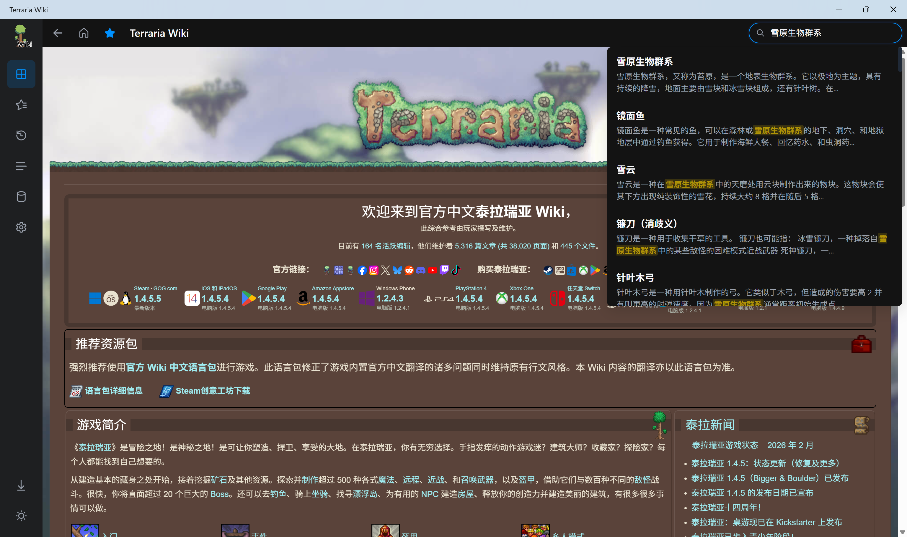
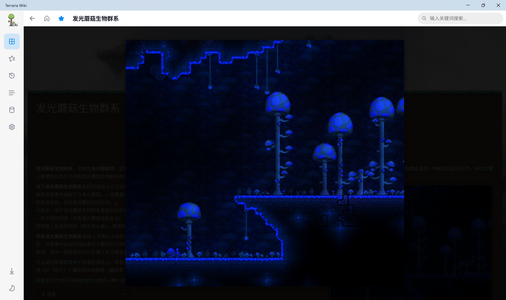
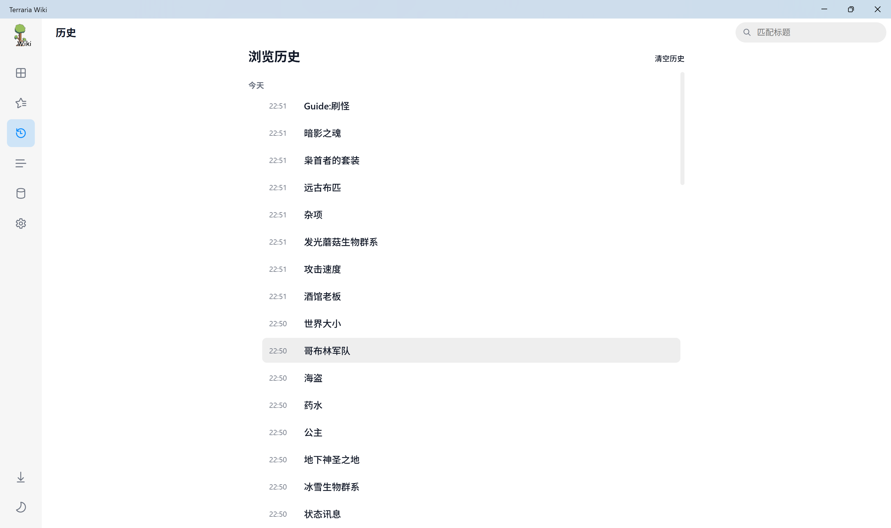
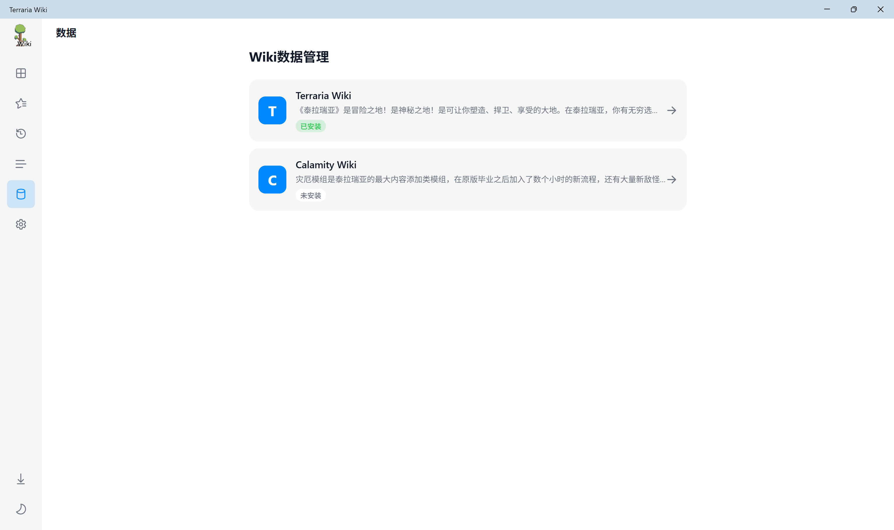
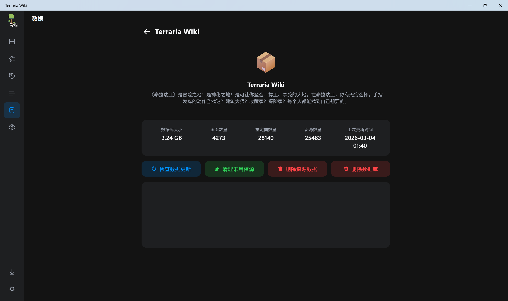
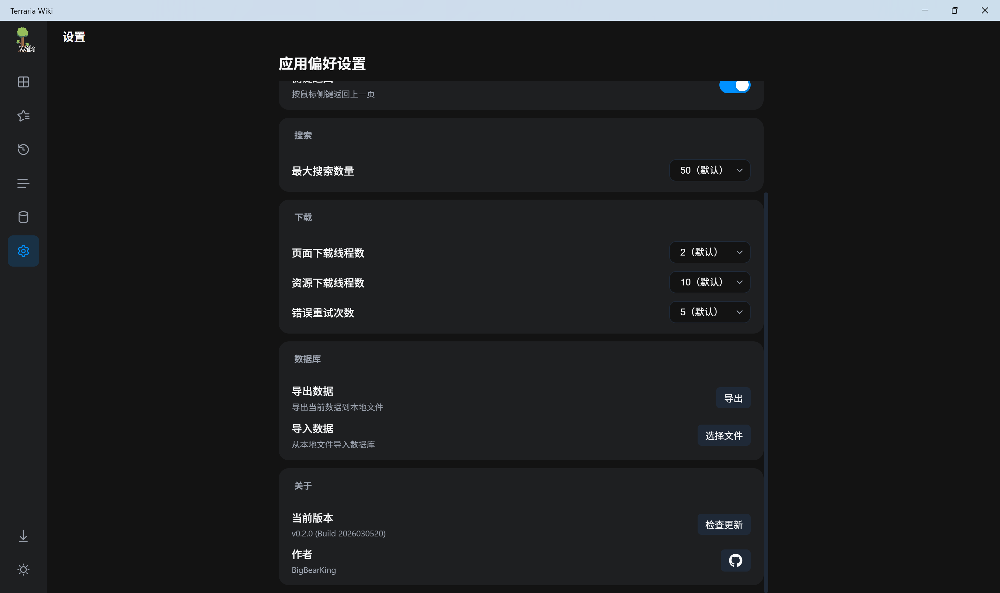

# Terraria Wiki Offline

一个使用 .NET MAUI Blazor Hybrid 构建的应用，提供快速、离线的泰拉瑞亚百科查阅体验。

[BigBearK的个人空间-BigBearK个人主页-哔哩哔哩视频](https://space.bilibili.com/470138112)

## 核心功能

### 1. 离线浏览

- **本地访问**: 文字、图片和音视频等数据均存储在本地，无需网络连接即可访问。
- **网页排版**: 使用内置本地 Web 服务器和 Iframe 渲染，保留官方 Wiki 的排版与样式。
- **页面跳转**: 通过拦截内部链接实现页面内的无刷新跳转。
- **图片查看**: 加入图片查看器，点击图片即可查看原图。

### 2. 搜索与索引

- **实时搜索**: 顶部搜索栏基于本地 SQLite 数据库提供关键字匹配，通过下拉面板预览词条。同时支持带列表其他页面的匹配关键词。
- **页面列表**: 提供 **所有页面** 总览视图，包含数据库的所有页面。

### 3. 历史记录与收藏夹

- **浏览历史**: 记录用户的页面访问历史。
- **收藏夹**: 支持收藏特定页面，收藏数据保存在本地 SQLite 数据库中。

### 4. 数据包管理

- **在线下载**: 在 **数据管理** 页面使用爬虫获取页面列表，支持全部下载或只下载文本数据，在下方输出栏显示日志。

  **（推荐从设置中导入数据包，因为通过官网下载数据会非常耗时，甚至会达到5小时以上。）**

- **页面更新**: 推荐使用，程序自动从官网获取需要更新的页面，比全部下载快很多。

- **资源管理**: 当你仅有文本数据的时候可以随时下载图片资源，同时可以方便的删除资源数据或整个数据库，释放空间。

- **状态显示**: 可以查看数据包的存储占用空间与页面数量、资源数量、更新时间等。

- **多Wiki管理（未来支持）**: 未来可能会支持灾厄等模组的 Wiki。

### 5. 设置

- **主题切换**: 支持亮色与暗色模式，可跟随系统设置自动切换或手动指定。
- **搜索设置**: 支持自定义最大搜索数量，但是设置过大可能会影响性能。
- **下载设置**: 支持自定义下载线程数，但是太过频繁可能会导致服务器拒绝访问，建议不要修改。
- **数据导入导出**: 推荐功能，一键导入非常方便。

## 首次使用指南

应用需要基础的维基数据包才能离线工作。首次打开时，请选择以下方式之一加载数据：

### 方式一：在线下载（不推荐）

1. 首次进入应用，前往 **数据管理** 页面。
2. 在列表中选择想要下载的 Wiki，点击进入。
3. 你可以选择下载所有内容，包括文本数据、图片、音视频等，大小约 3.5 GB；也可以只下载基础数据，仅包含文本，大小约 200 MB。
4. 等待下载完成重启即可使用。

### 方式二：本地导入

1. 提前下载后缀为 `.pak` 的离线数据包文件。

   我用夸克网盘分享了「TerrariaWiki」，点击链接即可保存。打开「夸克APP」，无需下载在线播放视频，畅享原画5倍速，支持电视投屏。
   链接：https://pan.quark.cn/s/9e4116487189
   提取码：J2zU

   

2. 打开应用，进入 **设置**。

3. 点击 **导入数据**，选择该 `.pak` 文件。

4. 等待导入完成重启即可使用。

   

## 开源致谢

本项目使用了以下开源模块与技术：

- [**.NET MAUI**](https://github.com/dotnet/maui) & [**Blazor**](https://dotnet.microsoft.com/en-us/apps/aspnet/web-apps/blazor): 跨平台 UI 与前端组件框架。

- [**html-agility-pack**](https://github.com/zzzprojects/html-agility-pack): 页面数据清洗和操作。

- [**sqlite-net**](https://github.com/praeclarum/sqlite-net): 本地数据库与数据持久化方案。

- [**官方中文泰拉瑞亚维基百科**](https://terraria.wiki.gg/zh/wiki/Terraria_Wiki): 本应用的内容和数据结构来自泰拉瑞亚维基社区贡献者的编辑与维护。

- **[handy-scroll](https://amphiluke.github.io/handy-scroll)**: 页面宽列表滚动条处理。

  

## 版权与协议

- 《泰拉瑞亚》(Terraria) 游戏及相关美术资源版权归 **Re-Logic** 所有。

- 应用内使用的 Wiki 文本及图片数据遵循 [**CC BY-NC-SA 4.0**](https://creativecommons.org/licenses/by-nc-sa/4.0/deed.zh-hans) 协议分发。

- 本应用客户端代码开源，免费提供，禁止用于商业牟利。

  

## 赞助与支持

本项目为个人开源项目，无广告。如果您希望支持后续的开发与维护，可以通过以下方式进行赞助：

捐助的所有资金将用于iOS AppStore的上架使用。捐助请备注联系方式或BiliBili UID。

目前捐助：110￥

- *浩

- L*B

- **辉

- *南

- **鑫

- 不卜庐七七
  

**支付方式**

- **微信**:

  

- **支付宝**:

  

  

您也可以在 GitHub 上为本项目点亮 **Star** 以表支持。
